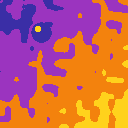

# @snomiao/rgui


**rgui** = the **R**enormalization **G**roup **U**ser **I**nterface — that is the name's
original purpose. (That the same letters also read as *readable grid* and *Royal Gramma*,
our mascot, is a happy accident we keep for fun.)

In physics, the renormalization group describes how a system looks at different scales:
zoom out, and microscopic detail is *coarse-grained* away — only the couplings that matter
at that scale survive. rgui applies exactly this to user interfaces. **Zoom is an RG flow**:
every element snaps to a screen-adaptive grid and stays legible at any zoom level, and whatever
cannot be drawn readably is not dropped but *replaced by a readable abstraction* via
semantic-zoom level-of-detail (LOD). Ships a Canvas 2D renderer today, with a WebGPU renderer
behind the same interface next. The only runtime dependencies are `d3-zoom` and `d3-selection`.

---

## What is rgui?

rgui is a framework-agnostic library that carries one principle through the whole UI:
the **readable grid**. The principle reduces to two rules.

1. **Every element snaps to a screen-adaptive readable grid.** The major grid spacing is
   continuously re-chosen on a 1-2-5 ladder so that it always keeps a constant readable pixel
   width, and nodes and ports snap to the finest grid. However far you zoom in or out, the
   spacing between elements never leaves "readable density".
2. **The view is readable at every zoom — because zoom is a renormalization-group flow.**
   The moment an element can no longer be drawn readably at the current scale, it does not
   vanish; it is replaced by a readable abstraction. This is semantic-zoom LOD: just before
   detail would smear, nodes collapse into pseudo-nodes, and nearby elements coarse-grain into
   a single cluster based on position. Nothing unreadable is ever left on screen — only the
   relevant couplings survive at each scale.

Rendering is currently Canvas 2D, but the renderer is swappable behind a single interface,
with a WebGPU implementation planned next. It mounts on any `<canvas>` and exposes the same
API to React, Vue, Svelte, or plain DOM.

## Install

```bash
bun add @snomiao/rgui
# or
npm install @snomiao/rgui
```

`d3-zoom` / `d3-selection` are pulled in automatically as dependencies. The package is pure
ESM; use it from a bundler (Vite, webpack, esbuild, …) or Node.js ESM.

## Quick start

```ts
import rgui, { demoGraph, type Graph } from "@snomiao/rgui";

const canvas = document.querySelector<HTMLCanvasElement>("#viewer")!;

// Build a dataflow graph in world coordinates, or use demoGraph() to start.
const graph: Graph = {
  nodes: [
    {
      id: "src",
      title: "Camera",
      category: "source",
      x: -240, y: -80, w: 200,
      inputs: [],
      outputs: [{ id: "image", label: "image", kind: "image" }],
      fields: [["device", "Default camera"]],
    },
    {
      id: "sink",
      title: "Vision model",
      category: "model",
      x: 80, y: -80, w: 220,
      inputs: [{ id: "image", label: "image", kind: "image" }],
      outputs: [{ id: "labels", label: "labels", kind: "text" }],
      fields: [["model", "YOLOS-tiny"]],
    },
  ],
  edges: [
    { from: { node: "src", port: "image" }, to: { node: "sink", port: "image" } },
  ],
};

// Mount a readable-grid viewer on the canvas.
const viewer = rgui(canvas, {
  graph,                        // or demoGraph() for a ready-made pipeline
  rule: { collapsePx: 48 },     // tune the readability thresholds (see below)
});

// Pan/zoom (d3-zoom), grid-snapped node dragging, and semantic-zoom LOD
// are all wired up automatically. Clean up when done:
viewer.destroy();
```

The `Rgui` object returned by `rgui(canvas, options)` carries the current view transform
`view`, the resolved rule set `rule`, read/write access to `graph`, a redraw request
`invalidate()`, and `destroy()`. `demoGraph()` returns a ready-made pipeline for smoke
testing — pass it first to see the behavior.

## RgRule — customizing the readability thresholds

Every readability decision in rgui is concentrated in a single `RgRule` object. Tune these
numbers per use case (dense DAW-style patching, sparse mind maps, dashboards, …). Pass a
partial object as `options.rule`; unspecified fields fall back to the defaults.

| Property | Default | Meaning |
| --- | --- | --- |
| `minGridPx` | `48` | Minimum on-screen spacing of major grid points (px). The basis of the readable grid. |
| `ladder` | `[1, 2, 5]` | Step ladder within a decade. Must be ascending divisors of 10. |
| `collapsePx` | `56` | A node collapses into a pseudo-node when its screen height falls below this (px). |
| `fieldMinPx` | `9` | Hide a node's field text when the row height falls below this (px). |
| `portLabelMinPx` | `6` | Hide port labels when the row height falls below this (px). |
| `clusterGapPx` | `24` | Screen-space gap budget for position-based cluster merging (px). |
| `clusterGapConnectedPx` | `40` | Connected nodes merge across a larger gap (px). |
| `pseudo` | `{ w: 200, headerH: 26, rowH: 18, pad: 8 }` | Pseudo-node screen dimensions in px (constant size on screen). |
| `declutterMarginPx` | `10` | Minimum gap kept between pseudo-nodes after decluttering (px). |

`DEFAULT_RULE` and `resolveRule(partial)` are exported so you can inspect the defaults or
resolve partial rules independently.

## API overview

The default export is `createRgui` (alias `rgui`). Named exports additionally expose the rg
math, model, and rendering pieces for standalone use without building the full UI. Everything
is framework-agnostic pure functions and plain data.

- **High level**: `createRgui`, types `Rgui`, `RguiOptions`
- **Grid math** (`core/grid`): `readableStep`, `gridLevels`, `finerStep`, `gridRange`, `snap`, `worldToScreen`, `screenToWorld`, types `ViewTransform`, `GridLevel`
- **Rules** (`core/rule`): `DEFAULT_RULE`, `resolveRule`, type `RgRule`
- **Graph model** (`core/graph`): `demoGraph`, `nodeHeight`, `inputPortPos`, `outputPortPos`, constants `NODE_HEADER_H` / `NODE_ROW_H` / `NODE_PAD` / `PORT_R`, types `Graph`, `GraphNode`, `Edge`, `Port`, `SignalKind`, `NodeCategory`
- **Semantic-zoom LOD** (`core/lod`): `buildRenderGraph`, `pseudoRect`, `pseudoPortPos`, `endpointPos`, types `RenderGraph`, `PseudoNode`, `RenderEdge`, `EndpointRef`
- **Renderer** (`render`): `createCanvas2DRenderer`, `createGridDotsLayer`, `gridDotsLayer`, `drawGraph`, `KIND_COLOR`, types `DrawLayer`, `GridRenderer`

TypeScript type definitions are bundled. To read the source directly, the raw TypeScript is
available from the `@snomiao/rgui/src` subpath.

## Roadmap

- **WebGPU renderer** — a drop-in rendering backend behind the same interface as the current Canvas 2D.
- **Auto layout** — initial placement and re-layout of node graphs.
- Richer LOD merging strategies and scaling to much larger graphs.
- i18n for docs (English-first for now).

## Mascot — Royal Gramma



The face of the project is the Royal Gramma (*Gramma loreto*), a small Caribbean reef fish whose
body shifts from violet to gold across a single seamless crossover — and whose initials happen to
spell **R**oyal **G**ramma = **RG**, the same letters as the renormalization group (a pun, not the
name's origin — see the top of this README). Look closely at a real one and the transition zone is
literally gold speckles over purple: the fish dithers itself, organically. One continuous flow,
readable at every scale.

The icon is implemented as a **function of position**, not a bitmap: it is generated natively at
any resolution from 8² to 4K, never resampled, always exactly 4 colors. The gradient direction is
the projection of the fish's 3-D swim direction — when the head points at the viewer, eyes appear.
The animated version advances exactly one scale octave per loop — a literal renormalization-group
flow — so frame N is pixel-for-pixel identical to frame 0. PNG sizes and loop GIFs (steady +
wandering) live in `assets/`, together with the generator (`assets/icon-lab.html`).

## License

MIT © snomiao
